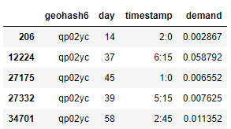
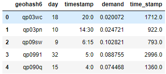
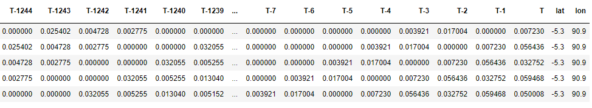
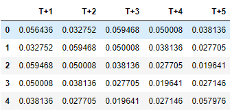
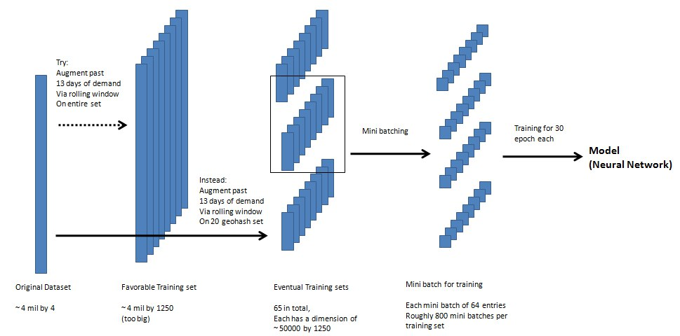
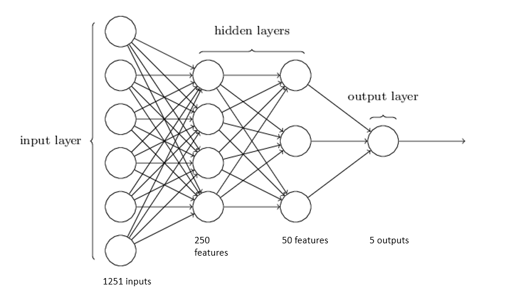
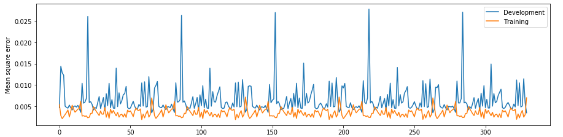

# Grab Challenge AI for SEA 2019

## Topic: Traffic 

### 1.Introduction
I would like to thank grab for giving me this opportunity to practice what I have learnt. 
I did a course on deeping learning just last week and I glad to be able to practice a few of the techniques here. 
To tackle this problem, I used a general 4 layer neural network.  
Please read through the notebooks below for the detail solution and how to test the model in the testing notebook
### 2.Important Files
#### 2.1.Notebooks
Here I explained my methodology and limitations.  [Training Notebook with detailed comments](Model_Preparation_and_Training.ipynb)
 
Refer upload your dataset into this notebook to obtain the mean square error as required.  [Testing Notebook for your test dataset ](Model_Testing.ipynb)

#### 2.2.Other files
**training_1st_half.csv,training_1st_half.csv** Combine to form original dataset (divided for uploading purpose only) 
**sample_test.csv** A random test set from the original data || placeholder for your test set 
**training_parameters.pkl** A pickle file containing [model parameters (weights), train accuracy,development accuracy , remaining training set]

### 3.Methodology
#### 3.1.Data
The goal is to use upto 14 days prior demand data to predict 5 timestamps worth of demand after time T. 
I used 13 days prior demand data as I do not wish to exceed the limit accidentally. 

The original data looks like:
The time stamp and day column is transformed into a running index to better keep track of the prior and after set at any time T. 

To train the dataset, I have to change it into the desire features of [demand on T-1248, demand on T-1247 ... demand on T, latitude, longitude] **1251** columns:
Example features: 
Example targets: 
**However this is caused memory issues (~160 GB required for such dataframe of roughly 4million by 1251)** 
Thus I used random sampling to seperate the training set into smaller subsets. And also adopted a minibatch approach in training.

#### 3.2.Model
I used a 3 layers neurual network as of following:

_picture taken from [http://neuralnetworksanddeeplearning.com/chap1.html] and edited on 15 June 2019_ 
**Each layer is activated by a rectilinear function, and its value calculated as a linear function of X @ W + b.** 
**The model is regulated via L2 regulation for less overfitting due to having 1251 inputs**  
where x is the output of last layer, W is the weights, and b is a constant
### 4.Results
The training and development(1%) error in terms of mean square error is measured as of following with respect to iterations of sub training set 
**The average mean standard error for training is 0.0034550717, while mean standard error for development is 0.006478587** 
 
The entire training set contains 66 sub training set (thus the pattern observed below)

The below graph shows the mean square error of development set for each loop of 66 sub trainin sets (entire training set): 
It shows a smaller but limited improvement as we continue the training. 
This could be due to the stochasticity of the small random sub set

### 5.Conclusion
I would consider the model a rather accurate predicition of the case.  
However it would perform much better if I am able to training on the entire dataset instead of resampling. 
I received the email about Amazon Web service just this week, however I had a lot difficulties setting up an Amazon account due to payment issues. I ended up training on my local host where the computing power and memory is limited. 
 
I would like to thank Grab once again for providing such an opportunity. 
And I wish you a pleasant read of my reading. 

Best Wishes, 
Zhou Zhi